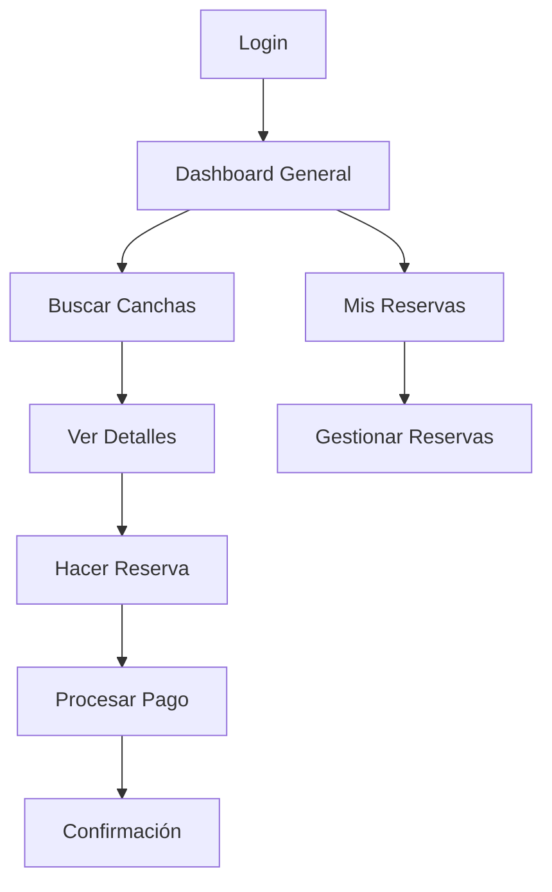
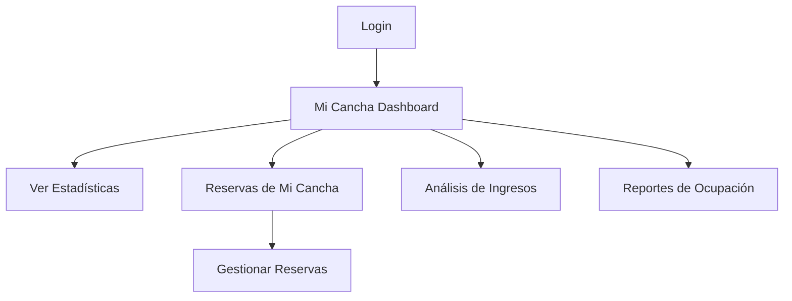
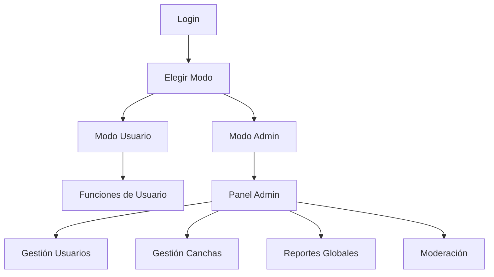

# 👥 Sistema de Roles y Permisos - Spelplaut

## 📋 Resumen Ejecutivo

El sistema de reserva de canchas **Spelplaut** implementa un sistema de roles robusto con **3 niveles de acceso** diferenciados, cada uno con permisos específicos y restricciones de seguridad para garantizar el aislamiento de datos y la correcta gestión del negocio.

## 🎯 Roles Implementados

### 🟢 Usuario Normal (`usuario`)

**Propósito**: Cliente final que reserva canchas para uso deportivo.

#### ✅ Permisos Otorgados

- **Reservas**:

  - Crear nuevas reservas en cualquier cancha disponible
  - Ver y gestionar sus propias reservas
  - Cancelar reservas (según políticas)
  - Recibir confirmaciones por email

- **Búsqueda y Navegación**:

  - Acceder a la página "Canchas" con búsqueda completa
  - Filtrar por ubicación, tipo, precio, disponibilidad
  - Ver detalles completos de cualquier cancha
  - Usar geolocalización para búsquedas cercanas

- **Gestión Personal**:

  - Actualizar perfil personal
  - Configurar/desactivar 2FA
  - Ver historial de reservas
  - Gestionar métodos de pago (futuro)

- **Pagos**:
  - Procesar pagos para sus reservas
  - Ver historial de pagos realizados

#### 🔍 Navegación Disponible

```
Header: [Canchas] [Mis Reservas] [Perfil] [Logout]
```

#### 🚫 Restricciones

- No puede acceder al panel de administración
- No puede ver reservas de otros usuarios
- No puede gestionar canchas
- No puede ver datos de negocio

---

### 🟡 Propietario de Cancha (`propietario_cancha`)

**Propósito**: Dueño de una cancha que gestiona su negocio deportivo.

#### ✅ Permisos Otorgados

- **Dashboard Exclusivo**:

  - Estadísticas detalladas de SU cancha únicamente
  - Análisis de ingresos (hoy, semana, mes)
  - Métricas de ocupación y rendimiento
  - Gráficos de reservas por horario

- **Gestión de Reservas**:

  - Ver TODAS las reservas de su cancha
  - Acceder a datos de contacto de clientes
  - Gestionar estados de reservas
  - Generar reportes de su cancha

- **Análisis de Negocio**:

  - Ingresos por período
  - Horarios más populares
  - Tasa de ocupación promedio
  - Reservas recientes con detalles

- **Gestión Personal**:
  - Actualizar su perfil
  - Configurar 2FA

#### 🔍 Navegación Disponible

```
Header: [Mi Cancha] [Perfil] [Logout]
```

#### 🚫 Restricciones Críticas

- **NO puede hacer reservas** (conflicto de interés)
- **NO puede acceder** a la página "Canchas"
- **Solo ve datos** de su `cancha_id` asignada
- **NO puede ver** datos de otras canchas
- **NO puede gestionar** usuarios o sistema
- **Redirección automática** a `/mi-cancha` al login

#### 🔒 Aislamiento de Datos

```typescript
// Ejemplo de filtro automático en APIs
const reservas = await Reserva.find({
  cancha_id: user.cancha_id, // Solo SU cancha
});
```

---

### 🔴 Administrador (`admin`)

**Propósito**: Gestión completa del sistema y moderación.

#### ✅ Permisos Completos

- **Funcionalidades de Usuario**:

  - Puede hacer reservas como cualquier usuario
  - Acceso completo a búsqueda de canchas
  - Gestión de perfil personal

- **Panel de Administración**:

  - Dashboard con estadísticas globales
  - Gestión completa de usuarios
  - CRUD completo de canchas
  - Moderación de contenido

- **Gestión de Reservas**:

  - Ver TODAS las reservas del sistema
  - Gestionar cualquier reserva
  - Acceso a datos completos de usuarios
  - Reportes globales

- **Gestión de Usuarios**:

  - Crear, editar, eliminar usuarios
  - Cambiar roles y permisos
  - Gestionar configuraciones 2FA
  - Moderar actividad

- **Gestión de Canchas**:

  - Crear nuevas canchas
  - Editar cualquier cancha
  - Asignar propietarios
  - Gestionar disponibilidad

- **Reportes y Analytics**:
  - Estadísticas globales del sistema
  - Reportes de ingresos totales
  - Análisis de uso por cancha
  - Métricas de usuarios activos

#### 🔍 Navegación Disponible

```
Header: [Canchas] [Mis Reservas] [Administración] [Perfil] [Logout]
```

#### ⚡ Privilegios Especiales

- **Sin restricciones** de acceso a datos
- **Puede actuar** como cualquier rol
- **Acceso completo** a todas las APIs
- **Permisos de moderación** y gestión

---

## 🔒 Implementación de Seguridad

### 🛡️ Validación en APIs

Cada endpoint protegido implementa validación de roles:

```typescript
// Ejemplo: API de reservas
export async function GET(request: NextRequest) {
  const userPayload = requireAuth(request);
  const user = await Usuario.findById(userPayload.userId);

  let filtros = {};

  if (user.rol === "usuario") {
    // Solo sus reservas
    filtros.usuario_id = user._id;
  } else if (user.rol === "propietario_cancha") {
    // Solo reservas de su cancha
    filtros.cancha_id = user.cancha_id;
  }
  // Admin ve todo (sin filtros)

  const reservas = await Reserva.find(filtros);
}
```

### 🚪 Control de Navegación

El componente `Header` adapta la navegación según el rol:

```typescript
// Header.tsx
const getNavItems = (rol: string) => {
  switch (rol) {
    case "usuario":
      return ["Canchas", "Mis Reservas"];
    case "propietario_cancha":
      return ["Mi Cancha"];
    case "admin":
      return ["Canchas", "Mis Reservas", "Administración"];
  }
};
```

### 🔄 Redirecciones Automáticas

El `AuthWrapper` maneja redirecciones según el rol:

```typescript
// AuthWrapper.tsx
useEffect(() => {
  if (user?.rol === "propietario_cancha") {
    router.push("/mi-cancha");
  }
}, [user]);
```

### 🚫 Bloqueo de Acciones

Validaciones específicas por rol:

```typescript
// API de reservas - Bloquear propietarios
if (user.rol === "propietario_cancha") {
  return NextResponse.json(
    {
      success: false,
      message: "Los propietarios no pueden hacer reservas",
    },
    { status: 403 }
  );
}
```

## 📊 Flujos de Usuario por Rol

### 🟢 Flujo Usuario Normal



### 🟡 Flujo Propietario



### 🔴 Flujo Administrador



## 🔧 Configuración de Roles

### 📝 Asignación de Roles

Los roles se asignan en el modelo de Usuario:

```typescript
// Usuario Schema
{
  rol: {
    type: String,
    enum: ["usuario", "propietario_cancha", "admin"],
    default: "usuario"
  },
  cancha_id: {
    type: mongoose.Schema.Types.ObjectId,
    ref: "Cancha",
    required: function() {
      return this.rol === "propietario_cancha";
    }
  }
}
```

### 🎯 Casos de Uso Específicos

#### Crear Propietario de Cancha

```typescript
// 1. Crear la cancha
const cancha = new Cancha({...});
await cancha.save();

// 2. Crear usuario propietario
const propietario = new Usuario({
  rol: "propietario_cancha",
  cancha_id: cancha._id,
  ...otrosDatos
});
await propietario.save();
```

#### Promover a Administrador

```typescript
await Usuario.findByIdAndUpdate(userId, {
  rol: "admin",
  $unset: { cancha_id: 1 }, // Remover cancha_id si existía
});
```

## 🚨 Consideraciones de Seguridad

### ⚠️ Puntos Críticos

1. **Aislamiento de Datos**: Los propietarios NUNCA deben ver datos de otras canchas
2. **Validación Doble**: Tanto en frontend como backend
3. **Logs de Auditoría**: Registrar cambios de roles y accesos
4. **Tokens JWT**: Incluyen el rol para validación rápida

### 🔍 Monitoreo y Auditoría

```typescript
// Ejemplo de log de auditoría
console.log(
  `[AUDIT] Usuario ${user.email} (${user.rol}) accedió a ${endpoint}`
);
```

### 🛠️ Testing de Permisos

Cada rol debe ser probado para:

- ✅ Acceso a funciones permitidas
- ❌ Bloqueo de funciones restringidas
- 🔒 Aislamiento de datos correcto
- 🚪 Navegación apropiada

## 📈 Métricas y Monitoreo

### 📊 KPIs por Rol

- **Usuarios**: Reservas realizadas, satisfacción
- **Propietarios**: Ingresos, ocupación, retención
- **Admins**: Actividad de moderación, crecimiento del sistema

### 🎯 Objetivos de Negocio

- **Usuarios**: Experiencia fluida de reserva
- **Propietarios**: Herramientas de gestión efectivas
- **Admins**: Control total y visibilidad del sistema

---

## 🔄 Actualizaciones y Mantenimiento

### 📅 Historial de Cambios

- **v1.0**: Implementación inicial de roles
- **v1.1**: Corrección de bug 2FA en operaciones post-login
- **v1.2**: Mejoras en aislamiento de datos de propietarios

### 🚀 Próximas Mejoras

- [ ] Roles granulares (sub-permisos)
- [ ] Gestión de equipos para propietarios
- [ ] Roles temporales y delegación
- [ ] Auditoría avanzada con dashboard

---

_Documento actualizado: Enero 2025_
_Sistema implementado y probado en producción_
